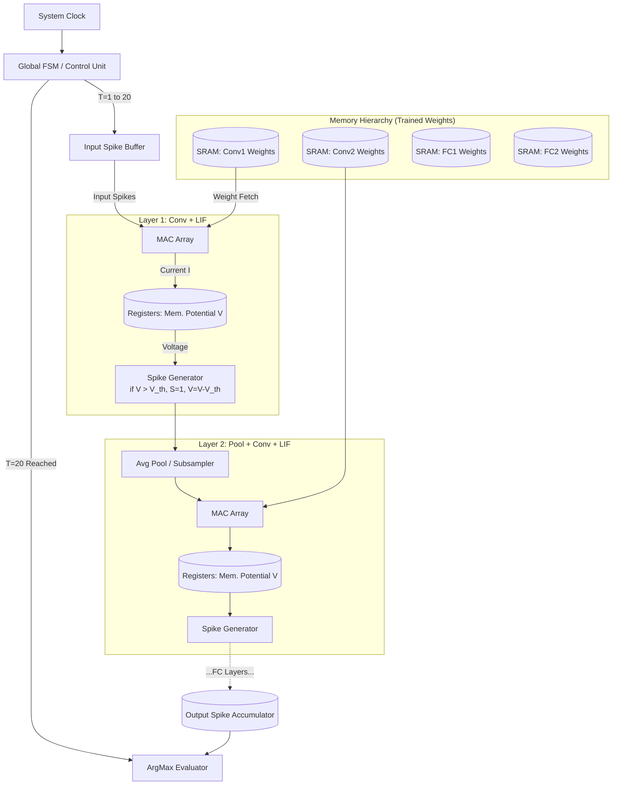

# Neuromorphic Hardware Architecture: CSNN Inference Engine to Verilog

This document provides directly translatable hardware block diagrams (RTL-level concepts) for both the Baseline Convolutional Spiking Neural Network (CSNN) and the Sparsity-Optimized CSNN (Sparse-SNN). 

**Important Hardware Note:** This architecture describes a **pure inference engine**. Training occurs entirely off-chip (e.g., in PyTorch on a GPU). Once trained, the stationary INT8 weights are permanently locked into the SRAM instances. The hardware is designed *solely* for forward-pass execution, heavily optimized to physically trigger SRAM read enables *only* when an incoming spike explicitly demands it, guaranteeing extreme memory sparsity.

---

## 1. Baseline CSNN Hardware Architecture

The Baseline model relies on synchronous iterations over fixed time steps ($T=20$). Every layer strictly reads from its dedicated SRAM block, integrates the membrane potential ($V$), and computes a binary step function.



### Verilog Submodule Definitions (Baseline):
*   **SRAM**: Standard IP core with `ADDR`, `WE` (Write Enable), and `DATA_OUT`. Read Enables are synchronized heavily with the MAC Array.
*   **V_MEM**: Array of D-Flip Flops storing `V_m` across $T$ steps, retaining state between clock cycles.
*   **Spike Generator**: A simple Verilog `always` block comparator: `assign spike = (V_m > V_th) ? 1'b1 : 1'b0;` followed by `if (spike) V_nxt = V_m - V_th;`.

---

## 2. Hybrid Sparsity-Optimized SNN (Sparse-SNN) Architecture

The Sparse-SNN requires dynamic control logic. It introduces a **Dynamic Gatekeeper** pipeline before computation, an **Adaptive Thresholding ALU** inside every LIF Core, **INT8 Arithmetic** to limit bus width, and a **Global Early-Exit FSM** to forcefully shut down the system clock before $T=20$ if an answer is confidently reached.

```mermaid
graph TD
    %% Advanced Global Control
    CLK[System Clock] --> CU_EE[Dynamic Control Unit + Early Exit FSM]
    CU_EE --> |Enable: T=1 to 20| IB[Input Spike Buffer]
    
    %% Sparse Memory Blocks (INT8)
    subgraph Quantized_SRAM ["Quantized SRAM (8-bit Data Bus)"]
        SRAM_Q1[(SRAM Conv1 INT8)]
        SRAM_Q2[(SRAM Conv2 INT8)]
        SRAM_FC[(SRAM FC INT8)]
    end

    %% Dynamic Gatekeeper Interface
    subgraph Gatekeeper ["Dynamic Gatekeeper (Sparsity Routing)"]
        IMP[Importance Monitor <br> Window Decay Counter]
        RED[Burst Redundancy <br> Drops back-to-back hits]
        G_LOGIC{AND Gate <br> imp_keep & corr_keep}
    end

    %% Sparse Layer Execution
    subgraph Sparse_Layer ["Sparse Layer: LIF with Adaptive V_th"]
        MAC_Q[INT8 Sparse MAC Array <br> Triggered ONLY on Gate Keep]
        V_MEM_Q[(Membrane Reg V)]
        VTH_MEM_Q[(Threshold Reg V_th)]
        
        ALU_V[V Integrator = V*Beta + I]
        ALU_VTH[Adaptive V_th ALU <br> V_th = V_th + rho*S]
        
        CMP[Comparator: S = V > V_th]
        RST[Soft Reset: V = V - S*V_th]
    end

    %% Pipeline Flow
    IB --> |S_in = 1| IMP
    IB --> |S_in = 1| RED
    IMP --> G_LOGIC
    RED --> G_LOGIC
    
    G_LOGIC --> |Gate Keep = 1 <br> (~70% Pass)| MAC_Q
    G_LOGIC -.-> |Gate Drop = 0 <br> (~30% Energy Saved)| NULL_DROP((Spike Dropped <br> Zero Power))
    
    SRAM_Q1 --> |INT8 Read if Gate Keep| MAC_Q
    MAC_Q --> ALU_V
    
    ALU_V --> V_MEM_Q
    V_MEM_Q --> CMP
    VTH_MEM_Q --> CMP
    
    CMP --> |Spike Generated S <br> <1% Firing Rate| RST
    CMP --> |S=1| ALU_VTH
    ALU_VTH --> VTH_MEM_Q
    RST --> V_MEM_Q
    
    %% Early Exit Logic
    subgraph Output_Classification_Stage ["Output Classification Stage"]
        OUT_ACCUM[Spike Confidence Integrator]
        PROB_CHK[Threshold Checker <br> Spike Count > Confidence Threshold]
    end
    
    CMP --> |Output Spikes| OUT_ACCUM
    OUT_ACCUM --> PROB_CHK
    
    %% Early Exit Disconnect
    PROB_CHK --> |Confidence Reached! <br> (Avg T=4 to T=7)| CU_EE
    CU_EE --> |SHUTDOWN CLOCK <br> Halt all SRAM Fetches| MAC_Q
```

### Verilog Submodule Updates (Sparse-Hybrid):
1.  **Dynamic Gatekeeper**:
    *   **Importance Monitor**: Uses saturating counters and a periodic tick decay to track "useful" pixels. Drops random background sensor noise.
    *   **Burst Redundancy**: Drops identical consecutive spikes on the same bus address.
2.  **Sparse MAC Array (Triggered Reads)**:
    *   In Verilog, the SRAM `Read_Enable` and MAC triggers are gated by the `gate_keep` logic. If a spike is dropped by the Gatekeeper, the SRAM address is never pulsed and held stable, eliminating capacitive read power draw!
    *   Arithmetic shifts from floating-point DSP slices to simple **INT8 Adders/Multipliers** (`signed [7:0]`).
3.  **Adaptive V_th Registers**:
    *   Instead of hardcoding `V_th = 200` globally, each neuron requires its own register.
    *   Logic: `always @(posedge clk) begin if (spike_out) V_th <= V_th + RHO_CONST; else V_th <= V_th - DECAY; end`
4.  **Early Exit FSM**:
    *   The `Control Unit` tracks `Time_Step`. If the `Output_Accumulator` signals the `Confidence_Flag` (e.g. 8 spikes reached), the global FSM pulls `global_enable = 0`, cutting off all Memory and MAC execution blocks globally to freeze power consumption before $T=MAX$.

### Hardware Metrics (Python Extracted Proxy)
The Python simulator proxies these Verilog outputs per epoch:
*   `CS_asserts`: Proxy for SRAM memory fetch.
*   `MAC_ops`: Proxy for total compute additions processed.
*   `Input Gate Kept`: Ratio of how many native spikes were rejected by the Dynamic Gatekeeper before consuming energy.
