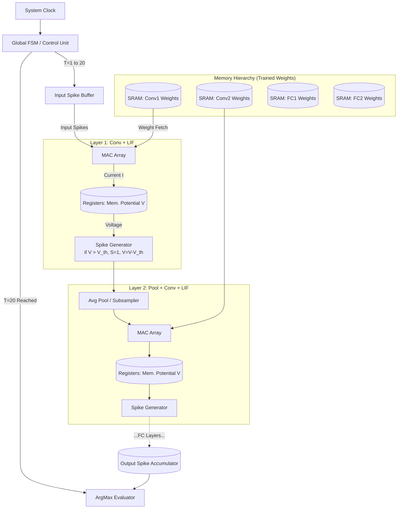
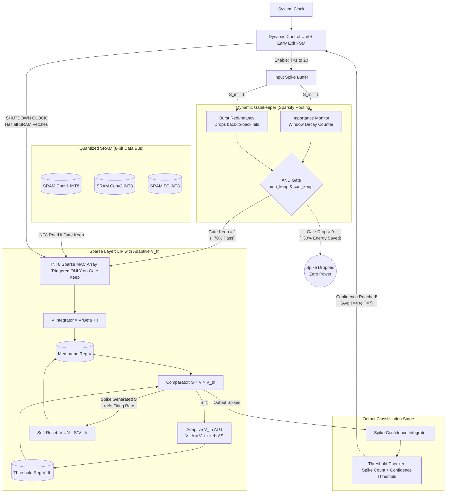
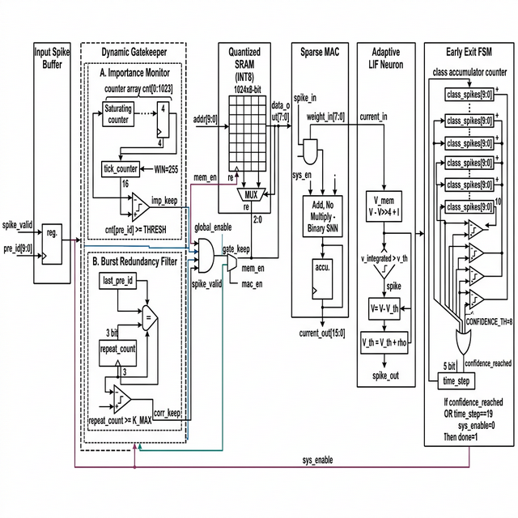

# Neuromorphic Hardware Architecture: CSNN Inference Engine to Verilog

This document provides directly translatable hardware block diagrams (RTL-level concepts) for both the Baseline Convolutional Spiking Neural Network (CSNN) and the Sparsity-Optimized CSNN (Sparse-SNN). 

**Important Hardware Note:** This architecture describes a **pure inference engine**. Training occurs entirely off-chip (e.g., in PyTorch on a GPU). Once trained, the stationary INT8 weights are permanently locked into the SRAM instances. The hardware is designed *solely* for forward-pass execution, heavily optimized to physically trigger SRAM read enables *only* when an incoming spike explicitly demands it, guaranteeing extreme memory sparsity.

---

## 1. Baseline CSNN Hardware Architecture

The Baseline model relies on synchronous iterations over fixed time steps ($T=20$). Every layer strictly reads from its dedicated SRAM block, integrates the membrane potential ($V$), and computes a binary step function.



### Verilog Submodule Definitions (Baseline):
*   **SRAM**: Standard IP core with `ADDR`, `WE` (Write Enable), and `DATA_OUT`. Read Enables are synchronized heavily with the MAC Array.
*   **V_MEM**: Array of D-Flip Flops storing `V_m` across $T$ steps, retaining state between clock cycles.
*   **Spike Generator**: A simple Verilog `always` block comparator: `assign spike = (V_m > V_th) ? 1'b1 : 1'b0;` followed by `if (spike) V_nxt = V_m - V_th;`.

---

## 2. Hybrid Sparsity-Optimized SNN (Sparse-SNN) Architecture

The Sparse-SNN requires dynamic control logic. It introduces a **Dynamic Gatekeeper** pipeline before computation, an **Adaptive Thresholding ALU** inside every LIF Core, **INT8 Arithmetic** to limit bus width, and a **Global Early-Exit FSM** to forcefully shut down the system clock before $T=20$ if an answer is confidently reached.



---

## 3. Unified Circuit Diagram

The following image shows the **complete digital circuit schematic** of the Sparse SNN inference pipeline as a single unified diagram. Every RTL block is shown with its internal components and inter-block signal connections, including the `sys_enable` feedback loop from the Early Exit FSM.



---

## 4. RTL Block Descriptions

Each Verilog module in `Hardware_Architecture/` implements a specific hardware function in the inference pipeline. Below is a detailed description of what each block does, its inputs/outputs, and its role in the overall system.

---

### 4.1 Dynamic Gatekeeper — `dynamic_gatekeeper.v`

**Purpose:** First-stage control gate that decides whether an incoming spike event should be processed or dropped before any downstream memory access occurs.

**What it does:**
- Receives every incoming spike event (`spike_valid`, `pre_id[9:0]`).
- Delegates the event to two internal sub-filters: the **Importance Monitor** and the **Burst Redundancy Filter**.
- Combines both filter outputs (`imp_keep`, `corr_keep`) with the global enable and spike validity through a 4-input AND gate.
- Produces the unified `gate_keep` signal that directly drives `mem_en` and `mac_en`.
- When `gate_keep = 0`, **no SRAM read occurs and no MAC computation fires**, eliminating all dynamic power for that event.

**Key Signals:**

| Signal | Direction | Description |
|---|---|---|
| `clk`, `rst_n` | Input | System clock and active-low reset |
| `global_enable` | Input | From Early Exit FSM (`sys_enable`) |
| `spike_valid` | Input | Indicates a non-empty input event |
| `pre_id[9:0]` | Input | Presynaptic neuron ID of the event |
| `gate_keep` | Output | 1 = process event, 0 = drop event |
| `mem_en` | Output | SRAM read-enable (= `gate_keep`) |
| `mac_en` | Output | MAC clock-enable (= `gate_keep`) |
| `gate_reason[1:0]` | Output | Reason code if event was rejected |

**Equation:**
```
gate_keep = global_enable AND spike_valid AND imp_keep AND corr_keep
```

---

### 4.2 Importance Monitor — `importance_monitor.v`

**Purpose:** Filters out low-information background noise by tracking the spatial density of events over a sliding time window.

**What it does:**
- Maintains a bank of **1024 saturating 4-bit counters** (`cnt[0:NUM_PRE-1]`), one per possible presynaptic input ID.
- Every time a spike arrives at address `pre_id`, the corresponding counter increments (saturating at 15).
- A 16-bit tick counter runs continuously. Every `WIN = 255` cycles, **all counters decay** via a right-shift by 1 bit (halving their value).
- The output `imp_keep` is asserted only if the counter for the current `pre_id` meets or exceeds `THRESH = 1`.
- Events from spatial coordinates with very low historical activity are treated as sensor noise and rejected.

**Key Signals:**

| Signal | Direction | Description |
|---|---|---|
| `spike_valid` | Input | Event present this cycle |
| `pre_id[9:0]` | Input | Address of the event source |
| `imp_keep` | Output | 1 = event is important, 0 = noise |

**Parameters:** `NUM_PRE=1024`, `ID_W=10`, `WIN=255`, `THRESH=1`

---

### 4.3 Burst Redundancy Filter — `burst_redundancy.v`

**Purpose:** Removes consecutive duplicate spike events targeting the same synapse, which add minimal new temporal information.

**What it does:**
- Stores the `last_pre_id` in a 10-bit register.
- On each spike, compares the current `pre_id` against `last_pre_id`.
- If they match, a 3-bit `repeat_count` counter increments.
- If `repeat_count >= K_MAX` (default 1), then `corr_keep = 0` — the spike is flagged as a burst duplicate and dropped.
- If a different `pre_id` arrives, `last_pre_id` updates and `repeat_count` resets to 1.

**Key Signals:**

| Signal | Direction | Description |
|---|---|---|
| `spike_valid` | Input | Event present this cycle |
| `pre_id[9:0]` | Input | Address of the event source |
| `corr_keep` | Output | 1 = unique event, 0 = burst duplicate |

**Parameters:** `ID_W=10`, `K_MAX=1`

**Hardware cost:** Minimal — one 10-bit register, one comparator, one 3-bit counter.

---

### 4.4 Quantized SRAM — `quantized_sram.v`

**Purpose:** Stores pre-trained INT8 weights and serves them to the MAC array only when a valid spike triggers a read.

**What it does:**
- Contains a 1024-entry × 8-bit memory array holding signed INT8 quantized weights.
- On rising clock edge, if `re = 1` (Read Enable), the weight at `addr` is driven onto `data_out`.
- If `re = 0`, `data_out` is forced to **zero** — preventing stale data from propagating into the MAC and ensuring no dynamic read power is consumed.
- `re` is driven by `mem_en` from the Dynamic Gatekeeper, meaning the SRAM is **completely dormant** when the gatekeeper drops an event.

**Key Signals:**

| Signal | Direction | Description |
|---|---|---|
| `clk` | Input | System clock |
| `addr[9:0]` | Input | Weight memory address |
| `re` | Input | Read Enable (from `mem_en`) |
| `data_out[7:0]` | Output | Signed INT8 weight value |

**Parameters:** `ADDR_WIDTH=10`, `DATA_WIDTH=8`

**Power note:** Because `re` is spike-gated, the SRAM array only switches when there is actual work to do. This is the primary mechanism for SRAM energy savings.

---

### 4.5 Sparse MAC (Multiply-Accumulate) — `sparse_mac.v`

**Purpose:** Performs the synaptic current accumulation. Because SNN inputs are binary (0 or 1), this is a **conditional adder**, not a multiplier.

**What it does:**
- Receives `spike_in` (binary) and `weight_in[7:0]` (INT8 from SRAM).
- If `spike_in = 1` AND `sys_en = 1`: accumulates the weight into `current_out` via simple addition.
- If `spike_in = 0`: does nothing — no switching activity, no power.
- Generates `read_req` back to the SRAM to fetch the next weight only when `spike_in = 1`.
- **No DSP multiplier is needed** because the input is binary: `spike × weight = weight` when spike=1, `0` when spike=0.

**Key Signals:**

| Signal | Direction | Description |
|---|---|---|
| `sys_en` | Input | Global enable from Early Exit FSM |
| `spike_in` | Input | Binary input spike (0 or 1) |
| `weight_in[7:0]` | Input | INT8 weight from Quantized SRAM |
| `read_req` | Output | SRAM read request (= `spike_in`) |
| `current_out[15:0]` | Output | 16-bit accumulated synaptic current |

**Parameters:** `DATA_WIDTH=8`, `ACCUM_WIDTH=16`

---

### 4.6 Adaptive LIF Neuron — `adaptive_lif.v`

**Purpose:** Implements the core spiking neuron with leak, threshold comparison, soft-reset, and **adaptive threshold** to enforce temporal sparsity.

**What it does:**
1. **Leaky Integration:** On each active cycle, the membrane potential leaks via shift-subtract approximation: `v_leaked = V_mem - (V_mem >>> 4)`, then adds the incoming current: `v_integrated = v_leaked + current_in`.
2. **Threshold Comparison:** Compares `v_integrated` against the adaptive threshold `v_th`. If `v_integrated >= v_th`, a spike is generated (`spike_out = 1`).
3. **Soft Reset:** When a spike fires, the membrane resets to `v_integrated - v_th` (not to zero), preserving residual charge for information retention.
4. **Adaptive Threshold:** After a spike, `v_th` increases by `rho` (punishing rapid firing). When no spike occurs, `v_th` decays toward `base_vth`. This implements a biological **refractory period** that forces sparse temporal coding.

**Key Signals:**

| Signal | Direction | Description |
|---|---|---|
| `sys_en` | Input | Global enable |
| `current_in[15:0]` | Input | Synaptic current from MAC |
| `base_vth[15:0]` | Input | Baseline firing threshold (150) |
| `rho[15:0]` | Input | Threshold increase per spike (10) |
| `spike_out` | Output | Binary spike output |

**Parameters:** `V_WIDTH=16`

**Effect on sparsity:** The adaptive threshold aggressively lowers the network-wide firing rate from 3.21% (baseline) to 0.78%, directly reducing downstream SRAM fetches in subsequent layers.

---

### 4.7 Early Exit FSM — `early_exit_fsm.v`

**Purpose:** Monitors output classification confidence and terminates the entire inference pipeline early when a class is confidently identified, avoiding unnecessary late time steps.

**What it does:**
1. Maintains **10 class accumulator counters** (`score[0:9]`), each incrementing when the corresponding bit of `class_spikes[9:0]` is 1.
2. A bank of **comparators** checks if any accumulator exceeds the confidence threshold (`CONFIDENCE_TH = 8`).
3. An **OR-reduction** across all comparators produces a single `confidence_reached` flag.
4. A 5-bit `time_step` counter tracks the current temporal position.
5. **Termination logic:** When `confidence_reached = 1` OR `time_step == T_MAX - 1`, the FSM deasserts `sys_enable` and asserts `done`.
6. `sys_enable = 0` is a **global clock-enable shutdown**: it propagates back to the Gatekeeper, MAC, and LIF blocks, freezing the entire pipeline and eliminating all further SRAM fetches.

**Key Signals:**

| Signal | Direction | Description |
|---|---|---|
| `class_spikes[9:0]` | Input | One-hot spikes from output layer |
| `sys_enable` | Output | Global pipeline enable (feedback) |
| `done` | Output | Inference complete flag |

**Parameters:** `NUM_CLASSES=10`, `T_MAX=20`, `CONFIDENCE_TH=8`

**Effect on latency:** 100% of test samples exit between T=4 and T=7, saving 65–80% of temporal computation cycles.

---

### 4.8 Top-Level Integration — `sparse_snn_top.v`

**Purpose:** Wires all individual RTL blocks into a single, complete inference pipeline with closed-loop control.

**What it does:**
- Connects the blocks in the following dataflow order:
  ```
  Input → Dynamic Gatekeeper → Quantized SRAM → Sparse MAC → Adaptive LIF → Early Exit FSM
  ```
- Routes the `sys_enable` output from the Early Exit FSM **back** to the Dynamic Gatekeeper and the Adaptive LIF as a global enable signal, creating a closed control loop.
- Passes configuration parameters (`base_vth = 150`, `rho = 10`) to the Adaptive LIF block.
- Exposes `done` and `sys_enable` as top-level outputs for external system integration.

**Key Parameters:**

| Parameter | Value | Description |
|---|---|---|
| `DATA_WIDTH` | 8 | INT8 weight precision |
| `ACCUM_WIDTH` | 16 | MAC accumulator width |
| `V_WIDTH` | 16 | Membrane potential precision |
| `ADDR_WIDTH` | 10 | SRAM address space (1024 entries) |
| `NUM_CLASSES` | 10 | N-MNIST digit classes |
| `T_MAX` | 20 | Maximum time steps |
| `CONFIDENCE_TH` | 8 | Early exit spike threshold |

---

## 5. Hardware Metrics (Python-Extracted Proxy)

The Python simulator proxies these Verilog outputs during inference:

| Metric | Hardware Signal Proxy | Measured Value |
|---|---|---|
| SRAM Fetches | `CS_asserts` (Chip-Select assertions) | ~52k sparse vs ~172k baseline |
| MAC Operations | `MAC_ops` (total additions processed) | Proportional to gated spikes |
| Input Rejection | `gate_keep = 0` ratio | 30.5% of events dropped |
| Firing Rate | Per-layer `spike_out` density | 0.78% sparse vs 3.21% baseline |
| Early Exit Step | Time step at `terminate = 1` | T=4 to T=7 average |
